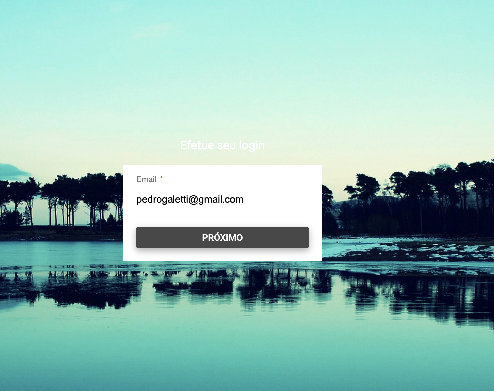

# Material Design Login 

**Warning**: This was one of my first projects when i was learning HTML, CSS and JavaScript



## Stack

- HTML
- CSS
- JavaScript

## Project structure

```
$PROJECT_ROOT
├── assets        # Image files
├── index.html    # Entry point
├── scripts.js    # Script point
└── styles.css    # Styles point
```